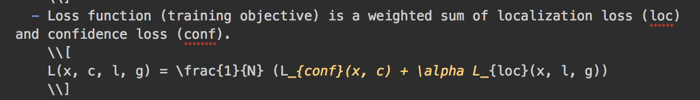
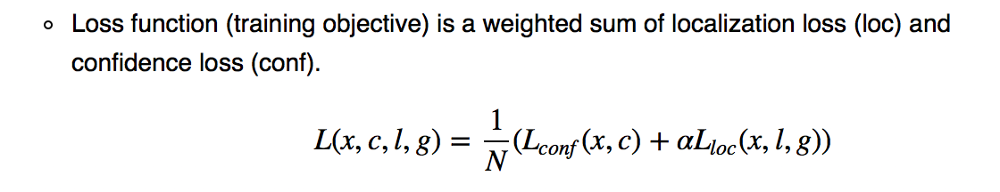

Solve the conflicts between Markdown and LaTeX 

# Markdown vs LaTeX

When I discovered Markdown earlier this year, I was thrilled as I have found a way to quickly transform my ideas into (relatively) beautifully formatted documents. The fact that some markdown editors (such as MacDown and Typora) also supports $\LaTeX$ encourages me to write and take notes more often. Naturally I use Github to host these notes and track changes. However, the lightweight Github flavored markdown ([GFM](https://github.github.com/gfm/)) does not support LaTeX, which makes it an eye sore to read posts with math equations. There are ways to circumvent this (e.g., replacing equations with pictures) but they are too kludgy and cumbersome for my taste.

I recently discovered Jekyll which allows the creation of static sites with Markdown. Github pages [supports Jekyll](https://help.github.com/articles/about-github-pages-and-jekyll/) and it rekindled my enthusiasm to blog again. Another bonus point is that Jekyll can be easily configured with Mathjax, which means it is finally possible to easily (or so I thought) migrate my LaTeX-ridden old markdown notes to beautifully typeset Github pages. However LaTeX and markdown are not always straightforward. For example, in MacDown v0.7.1,

See the markdown editor's syntax highlighting is confused about the use of underscores ("_") in the LaTeX block and mistakenly treat them as emphasis markers. Fortunately MacDown renders it correctly as subscript marker.

Jekyll uses Kramdown as the markdown converter and at first I was really disappointed at the converted result, when "_", "*", "|" in LaTeX blocks are mistakenly interpreted as markdown or html markers. A quick googling yields good results, and they also provided good workaround.

- [Markdown interferes with Mathjax](https://github.com/mathjax/MathJax/issues/329)
- [Use \vert to replace | in LaTeX](https://github.com/gettalong/kramdown/issues/46)
- [Use back ticks to escape](http://gohugo.io/content-management/formats/#issues-with-markdown:d97e838dbdddd8f0d2665b07f195e51f)
- [Use hugo](https://takuti.me/note/hugo-markdown-and-mathjax/)

However I also wanted a solution that would allow me to continue visualize equations in MacDown. Some solutions such as using back ticks would break MacDown's rendering. After some trial and error, the following guideline works best for me. 

- Use `\vert` to replace `|` in LaTeX blocks
- Insert spaces before and after `_` and `*` in LaTeX blocks

Now LaTeX rendering works in both MacDown (including the syntax highlighting) and Github pages with Mathjax.