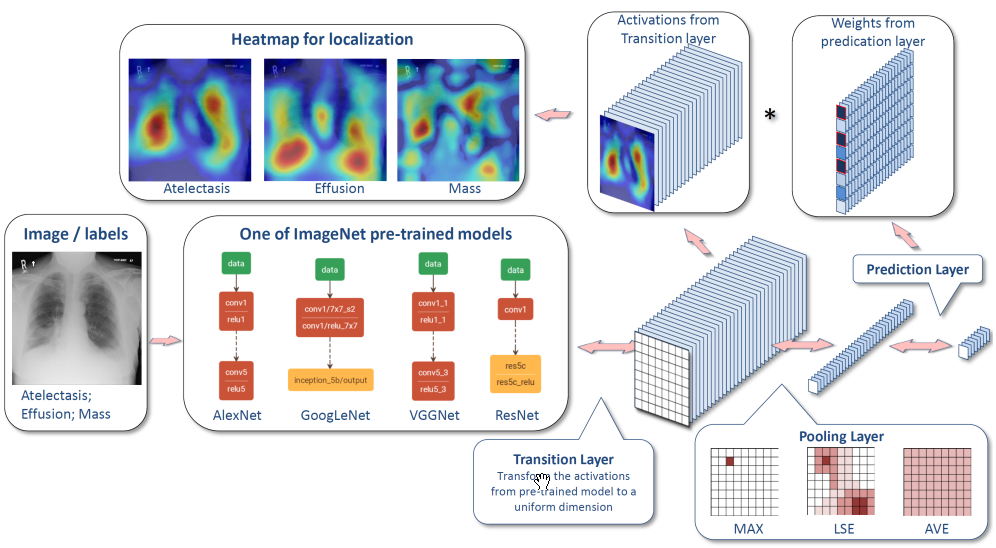

This note records research papers on deep learning in medical imaging. 
<!-- break -->

# Deep Learning in Medical Imaging

Compiled by Patrick Liu 

<!-- vim-markdown-toc GFM -->

* [Medical applications
](#medical-applications)
    * [ChestX-ray8
](#chestx-ray8)
    * [CNN feature extractor for TB
](#cnn-feature-extractor-for-tb)

<!-- vim-markdown-toc -->

## Medical applications
### ChestX-ray8

- [ChestX-ray8: Hospital-scale Chest X-ray Database and Benchmarks on Weakly-Supervised Classification and Localization of Common Thorax Diseases](https://arxiv.org/abs/1705.02315)
- Architecture
  
- Classification loss function:
  - Wiki page [loss functions for classification](https://en.wikipedia.org/wiki/Loss_functions_for_classification)
- TBC
  
### CNN feature extractor for TB
- [Pre-trained convolutional neural networks as feature extractors for tuberculosis detection](http://www.sciencedirect.com/science/article/pii/S0010482517302548)
- Use three CNN architectures (**ResNet, GoogLeNet, VGG**) as feature extractor (without fine-tuning of CNN layers) for classification of TB.
- Dataset: 
	- Shenzhen: 336 positive + 326 negatives
	- Montgomery: 58 positives + 80 negatives. Each image has a lung region mask.
- Three proposed approaches:
	1. CNN feature extraction + SVM: Lung region segmentation, resize CR images (~224), CNN feature extraction, SVM. 
	2. Bag of CNN features: Lung region segmentation, divide high resolution CR images into overlapping subregions (~224), extract features on each subregion, K-means clustering to create a dictionary of visual characteristics, create histogram of visual characteristics as global bag descriptor, SVM. This formulates the TB classification as a MIL (multiple instance learning) problem.
	3. Ensemble methods: ensemble of classifiers based on 3 CNN architectures for both approach 1 and 2. 
- Key findings:
	- Results on Shenzhen dataset is better than Montgomery. This is consistent with literature, perhaps due to dataset size. 
	- No clear winner among three architectures. 150-layer ResNet may be an overkill for such a task.
	- Approach 1 (naïve CNN extractor) achieved pretty good accuracies of 0.78 (Montgomery) and 0.83 (Shenzhen).
	- Approach 2 (bag of CNN features) achieved better performance than Approach 1, and superior results than a fine tuned network using 512x512 inputs. 
	- Approach 3 (ensemble) does not improve the results a lot, most likely due to the large correlation of errors between the features extracted by different CNNs (ensemble works best if there is large diversity in the errors).
- Takeaways: 
	- Use a larger input size may help with classification where high resolution details contain much relevant information.
	- Ensemble methods of multiple networks may not achieve better results due to large correlations of errors of base CNN-based classifiers.
