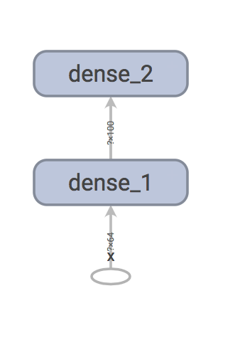
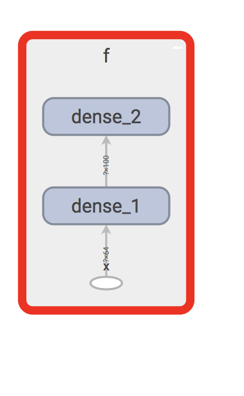
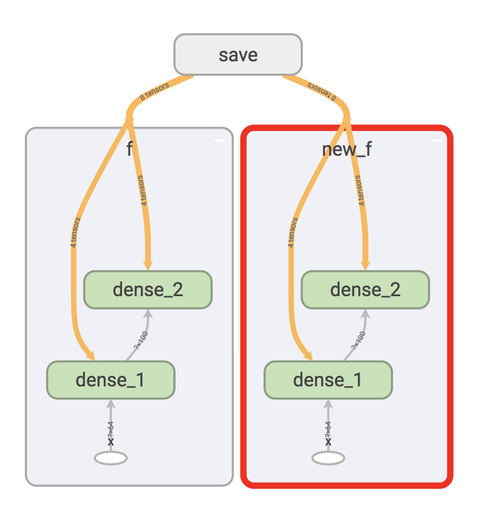
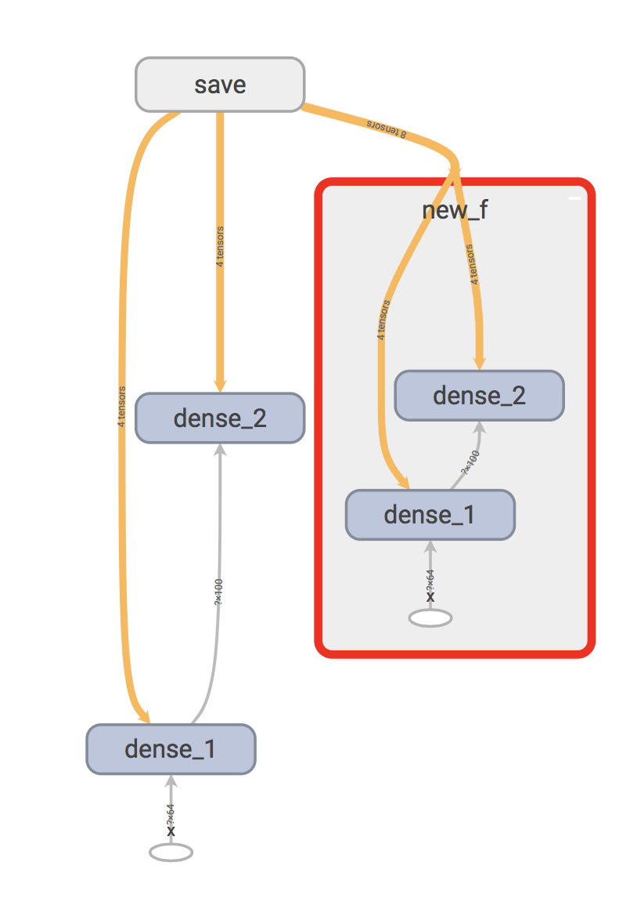
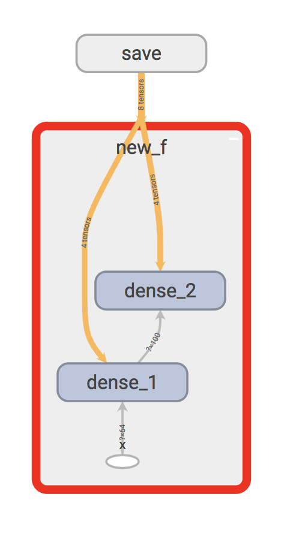

Solve the conflicts between Markdown and LaTeX 

# Editing graph in Tensorflow

**Tensorflow** employs the idea of Symbolic Computation which consists of two distinctive stages: construction of a computing graph and execution of the graph. This is very different from Imperative Computing where the computation is executed at the same time when it is defined. In addition, Tensorflow uses static computational graph, which is an [append-only data structure](https://stackoverflow.com/questions/34235225/is-it-possible-to-modify-an-existing-tensorflow-computation-graph). (In contrast, **PyTorch** uses imperative computing and dynamic graphs. Please refer to the [video by Siraj](https://www.youtube.com/watch?v=nbJ-2G2GXL0) for a nice quick overview.)

As appending new nodes is the only legal operation allowed by Tensorflow's Graph class, it is technically not possible to edit the graph. However, there is some workaround, for example, copying data from one graph, doing some editing on the fly and saving to another graph. In this way, the graph can be edited. 

### Put (part of) the original graph into a new name scope
One possible use case of migrating the whole graph into a new name scope is as follows. I have trained the same network multiple times and now I want to combine them into different branches of one graph. The following example follows that from this post on [qiita](https://qiita.com/kzm4269/items/28b290c84f13710959ec) (日本語できてよかった！).

Let's build one simple graph first. 

```python
import tensorflow as tf
def f():
    """Generating graph and return input and output tensors"""
    with tf.variable_scope(""):
        x = tf.placeholder(tf.float32, (None, 64), name='x')
        h = x
        h = tf.layers.dense(h, 100, name='dense_1')
        h = tf.layers.dense(h, 100, name='dense_2')
        y = h
        return x, y

with tf.Graph().as_default():
    # create graph
    x, y = f()
    tf.summary.FileWriter('/tmp/tensorboard', graph=tf.get_default_graph()).close()
```

In tensorboard, we can see the following graph.


Of course, we can assign a scope to this: `with tf.variable_scope("f")`.


It is well known that `tf.train.export_meta_graph` and `tf.train.import_meta_graph` can be used to save and restore graphs, but we can use `export_scope` and `import_scope` kwargs to manipulate the name scopes. For example, 

```python
meta_graph = tf.train.export_meta_graph(export_scope='f')
tf.train.import_meta_graph(meta_graph, import_scope='new_f')
```



And we can also put the whole graph (without original name scope) into a new name scope.
```python
...
    with tf.variable_scope(""):
...
meta_graph = tf.train.export_meta_graph(export_scope='')
tf.train.import_meta_graph(meta_graph, import_scope='new_f')
```



And clearing off the old graph.
```python
with tf.Graph().as_default():
    x, y = f()
    meta_graph = tf.train.export_meta_graph(export_scope='f')

with tf.Graph().as_default():
    tf.train.import_meta_graph(meta_graph, import_scope='new_f')
    tf.summary.FileWriter('/tmp/tensorboard', graph=tf.get_default_graph()).close()
```


Now all the nodes in the original graph is placed under a new name scope "new_f".

There is now an graph editor in Tensorflow's contrib module [`tf.contrib.graph_editor`](https://www.tensorflow.org/api_docs/python/tf/contrib/graph_editor). This is not part of the official API yet and the syntax is subject to heavy change. I would recommend exploring it if it is absolutely needed (or if I have some extra time to kill 🤣). 